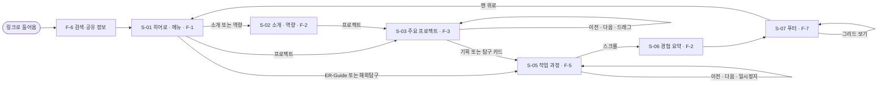
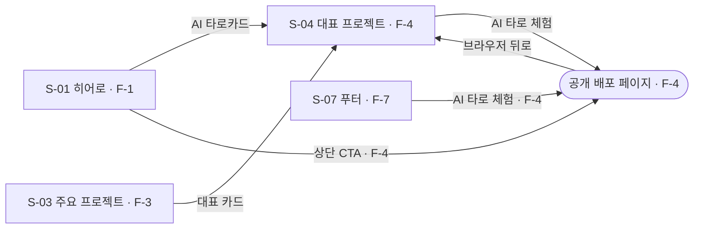

# 김유빈 포트폴리오 유저플로우

## 소개와 프로젝트 탐색 (시나리오 1 · 3)

```mermaid
flowchart LR
    IN(["링크로 들어옴"]) --> SEO["F-6 검색·공유 정보"]
    SEO --> S1["S-01 히어로 · 메뉴 · F-1"]
    S1 -->|소개 또는 역량| S2["S-02 소개 · 역량 · F-2"]
    S1 -->|프로젝트| S3["S-03 주요 프로젝트 · F-3"]
    S2 -->|프로젝트| S3
    S3 -->|이전 · 다음 · 드래그| S3
    S1 -->|ER-Guide 또는 해외탐구| S5["S-05 작업 과정 · F-5"]
    S3 -->|기획 또는 탐구 카드| S5
    S5 -->|이전 · 다음 · 일시정지| S5
    S5 -->|스크롤| S6["S-06 경험 요약 · F-2"]
    S6 --> S7["S-07 푸터 · F-7"]
    S7 -->|맨 위로| S1
    S7 -->|그리드 보기| S7
```

## 대표 프로젝트 체험 (시나리오 2)

```mermaid
flowchart LR
    S1["S-01 히어로 · F-1"] -->|AI 타로카드| S4["S-04 대표 프로젝트 · F-4"]
    S3["S-03 주요 프로젝트 · F-3"] -->|대표 카드| S4
    S4 -->|AI 타로 체험| APP(["공개 배포 페이지 · F-4"])
    S1 -->|상단 CTA · F-4| APP
    S7["S-07 푸터 · F-7"] -->|AI 타로 체험 · F-4| APP
    APP -->|브라우저 뒤로| S4
```

- 모바일 메뉴 링크와 데스크톱 메뉴는 같은 섹션으로 연결된다. (F-1)
- 배포 페이지에서의 입력이나 결과 생성은 포트폴리오의 범위 밖이다. (F-4)

---
